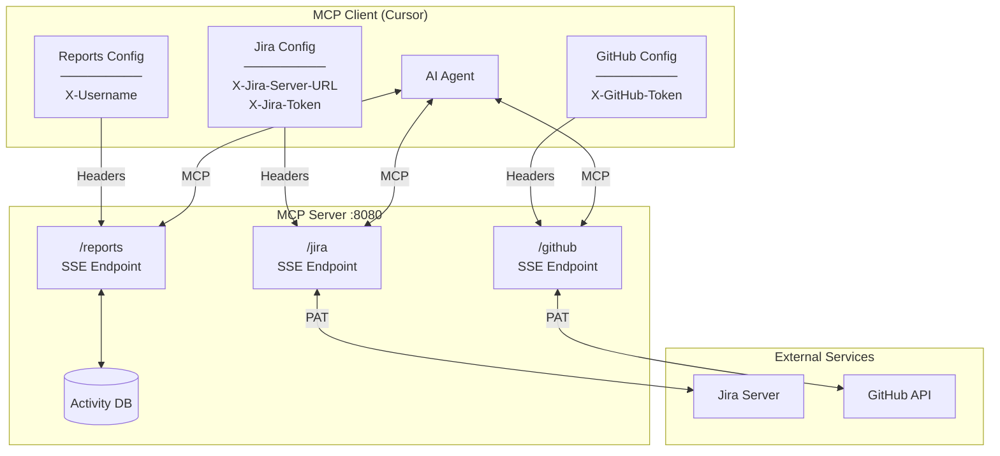
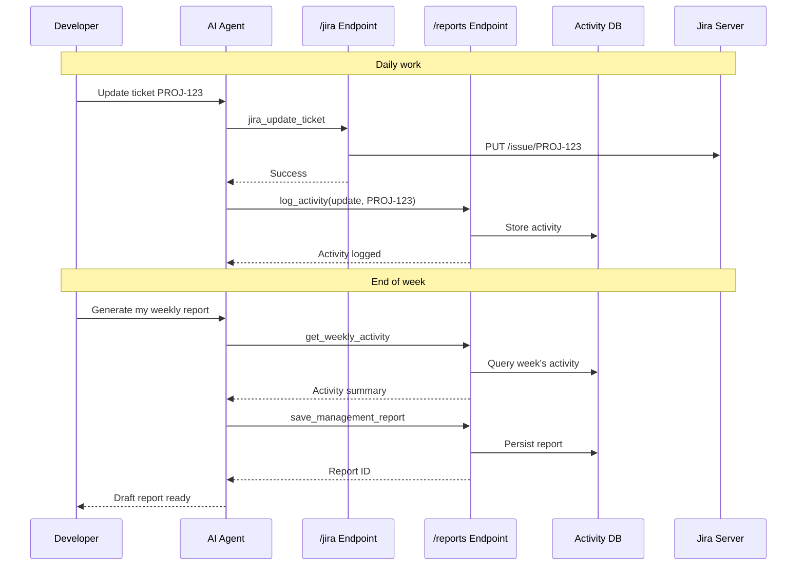

# Jira MCP Server

[](https://www.python.org/downloads/)
[](https://opensource.org/licenses/MIT)
[](https://modelcontextprotocol.io/)

A Model Context Protocol (MCP) server that connects Jira and GitHub to AI-powered IDEs. Developers spend less time writing status updates—the IDE pulls real data and drafts reports from actual activity.

## Quick Start

```bash
# 1. Install
git clone <repository-url> && cd jira-mcp
python -m venv venv && source venv/bin/activate
pip install -e .

# 2. Run server
jira-mcp --port 8080

# 3. Configure Cursor IDE (.cursor/mcp.json)
```

```json
{
  "mcpServers": {
    "jira": {
      "url": "http://localhost:8080/jira",
      "headers": {
        "X-Jira-Server-URL": "https://jira.example.com",
        "X-Jira-Token": "your-jira-pat"
      }
    },
    "github": {
      "url": "http://localhost:8080/github",
      "headers": {
        "X-GitHub-Token": "your-github-pat"
      }
    },
    "reports": {
      "url": "http://localhost:8080/reports",
      "headers": {
        "X-Username": "your-username"
      }
    }
  }
}
```

## Overview

Developers interact with Jira and GitHub daily. This server exposes those systems as structured MCP tools via separate endpoints, tracks activity locally, and generates weekly or management reports on demand. Credentials flow from the client via HTTP headers; the server stores only activity logs and reports.



## Report Generation Flow



## Features

### Jira Operations (`/jira` endpoint)
- **Tickets** — List, view, create, update
- **Comments** — Add, update, delete
- **Hierarchy** — Link issues, create subtasks, set epics
- **Metadata** — Projects, components, issue types, statuses, transitions, priorities

### GitHub Operations (`/github` endpoint)
- **Pull Requests** — List, view details, files, commits, diff
- **Reviews & Comments** — Fetch feedback threads, add comments
- **Search** — Query PRs across repositories

### Reports Operations (`/reports` endpoint)
- **Activity Tracking** — Log actions on tickets for later reporting
- **Weekly Reports** — Generate and save Markdown reports from logged activity
- **Management Reports** — Store and manage AI-written summaries for stakeholders

## Requirements

- Python 3.11+
- Jira Server or Data Center with PAT authentication
- (Optional) GitHub PAT for PR tools

## Installation

```bash
git clone <repository-url>
cd jira-mcp
python -m venv venv
source venv/bin/activate
pip install -e .
```

## Creating Personal Access Tokens

### Jira PAT

1. Log in to your Jira instance
2. Click your profile icon → **Profile**
3. Go to **Personal Access Tokens** (left sidebar)
4. Click **Create token**
5. Enter a name (e.g., "MCP Server") and set expiration
6. Click **Create** and copy the token immediately (it won't be shown again)

**Required permissions:** The token inherits your Jira user permissions. Ensure you have access to the projects you want to query.

### GitHub PAT

1. Go to [GitHub Settings → Developer settings → Personal access tokens → Tokens (classic)](https://github.com/settings/tokens)
2. Click **Generate new token (classic)**
3. Enter a note (e.g., "MCP Server")
4. Select scopes:
   - `repo` — Full control of private repositories (or `public_repo` for public only)
   - `read:org` — Read org membership (if querying org repos)
5. Click **Generate token** and copy it immediately

**For GitHub Enterprise:** Use the same process on your enterprise instance, then set the `X-GitHub-API-URL` header to your API endpoint (e.g., `https://github.yourcompany.com/api/v3`).

## Configuration

### Client-Side Headers

Credentials are passed from the MCP client via headers. Each endpoint requires its own headers.

**Jira (`/jira`):**

| Header | Required | Description |
|--------|----------|-------------|
| `X-Jira-Server-URL` | Yes | Jira base URL |
| `X-Jira-Token` | Yes | Jira Personal Access Token |
| `X-Jira-Verify-SSL` | No | `true` (default) or `false` |

**GitHub (`/github`):**

| Header | Required | Description |
|--------|----------|-------------|
| `X-GitHub-Token` | Yes | GitHub PAT |
| `X-GitHub-API-URL` | No | GitHub Enterprise API URL |

**Reports (`/reports`):**

| Header | Required | Description |
|--------|----------|-------------|
| `X-Username` | Yes | Username for activity tracking |

### Server-Side (Optional)

Only needed for database configuration.

| Variable | Default | Description |
|----------|---------|-------------|
| `DATABASE_URL` | — | PostgreSQL connection string |
| `JIRA_MCP_DATA_DIR` | `./data` | SQLite storage directory |

## Client Setup

### Cursor IDE

Configure three MCP servers in `.cursor/mcp.json`:

```json
{
  "mcpServers": {
    "jira": {
      "url": "http://localhost:8080/jira",
      "headers": {
        "X-Jira-Server-URL": "https://jira.example.com",
        "X-Jira-Token": "your-jira-pat"
      }
    },
    "github": {
      "url": "http://localhost:8080/github",
      "headers": {
        "X-GitHub-Token": "your-github-pat"
      }
    },
    "reports": {
      "url": "http://localhost:8080/reports",
      "headers": {
        "X-Username": "your-username"
      }
    }
  }
}
```

For GitHub Enterprise:

```json
{
  "mcpServers": {
    "github": {
      "url": "http://localhost:8080/github",
      "headers": {
        "X-GitHub-Token": "your-github-pat",
        "X-GitHub-API-URL": "https://github.yourcompany.com/api/v3"
      }
    }
  }
}
```

## Running the Server

### Local

```bash
jira-mcp --host 0.0.0.0 --port 8080
```

### Docker

```bash
docker build -t jira-mcp:latest -f Containerfile .
docker run -d -p 8080:8080 -v jira-mcp-data:/app/data --name jira-mcp jira-mcp:latest
```

### Docker Compose

```bash
# SQLite (default)
docker-compose up -d jira-mcp

# PostgreSQL
docker-compose --profile postgres up -d
```

## Endpoints

| Endpoint | Description |
|----------|-------------|
| `/health` | Health check |
| `/jira` | Jira MCP tools (SSE) |
| `/jira/messages/` | Jira message handler |
| `/github` | GitHub MCP tools (SSE) |
| `/github/messages/` | GitHub message handler |
| `/reports` | Reports MCP tools (SSE) |
| `/reports/messages/` | Reports message handler |

## Tool Reference

### Jira Tools (`/jira`)

| Tool | Description |
|------|-------------|
| `jira_list_tickets` | Search tickets by assignee, project, component, epic, status |
| `jira_get_ticket` | Get full ticket details |
| `jira_create_ticket` | Create a new ticket |
| `jira_update_ticket` | Update fields or transition status |
| `jira_add_comment` | Add a comment |
| `jira_get_comments` | List comments |
| `jira_update_comment` | Edit a comment |
| `jira_delete_comment` | Delete a comment |
| `jira_link_issues` | Link two issues |
| `jira_create_subtask` | Create a subtask |
| `jira_set_epic` | Assign an issue to an epic |
| `jira_list_projects` | List accessible projects |
| `jira_list_components` | List components for a project |
| `jira_list_issue_types` | List issue types for a project |
| `jira_list_priorities` | List priority levels |
| `jira_list_statuses` | List statuses for a project |
| `jira_get_transitions` | Get available transitions for a ticket |
| `jira_get_current_user` | Get authenticated user info |

### GitHub Tools (`/github`)

| Tool | Description |
|------|-------------|
| `github_list_prs` | List PRs for a repository |
| `github_get_pr` | Get PR details |
| `github_get_pr_diff` | Get unified diff |
| `github_get_pr_files` | List changed files with patches |
| `github_get_pr_commits` | List commits in PR |
| `github_get_pr_reviews` | Get reviews |
| `github_get_pr_comments` | Get issue and review comments |
| `github_add_pr_comment` | Add a comment to a PR |
| `github_search_prs` | Search PRs across repositories |
| `github_get_current_user` | Get authenticated GitHub user |

### Reports Tools (`/reports`)

| Tool | Description |
|------|-------------|
| `log_activity` | Record work on a ticket |
| `get_weekly_activity` | Summarize activity for a week |
| `generate_weekly_report` | Generate Markdown report |
| `save_weekly_report` | Persist report to database |
| `list_saved_reports` | List saved reports |
| `get_saved_report` | Retrieve a report by ID |
| `delete_saved_report` | Delete a report |
| `save_management_report` | Store AI-generated stakeholder report |
| `list_management_reports` | List reports, optionally by project |
| `get_management_report` | Retrieve full report content |
| `update_management_report` | Edit an existing report |
| `delete_management_report` | Delete a report |

## Example Prompts

- *"List my in-progress Jira tickets and summarize blockers."* (uses `/jira`)
- *"Show open PRs for org/repo and summarize review feedback."* (uses `/github`)
- *"Log that I worked on PROJ-123 today."* (uses `/reports`)
- *"Generate my weekly report and save it."* (uses `/reports`)
- *"Write a management report for PROJ using this week's activity."* (uses `/reports`)

## Project Structure

```
jira-mcp/
├── src/jira_mcp/
│   ├── server.py           # SSE transport, /jira, /github, /reports endpoints
│   ├── jira_client.py      # Jira API wrapper
│   ├── github_client.py    # GitHub API wrapper
│   ├── config.py           # Configuration helpers
│   ├── db/
│   │   ├── database.py     # Database connection
│   │   └── models.py       # SQLAlchemy models
│   └── tools/
│       ├── tickets.py      # Ticket tools
│       ├── comments.py     # Comment tools
│       ├── discovery.py    # Metadata tools
│       ├── reports.py      # Activity and report tools
│       └── schemas.py      # Pydantic schemas
├── tests/
├── Containerfile
├── docker-compose.yaml
├── pyproject.toml
└── README.md
```

## Troubleshooting

| Issue | Resolution |
|-------|------------|
| SSL errors | Set `X-Jira-Verify-SSL: false` in client headers |
| Auth failures | Verify PAT is valid and has required permissions |
| Connection refused | Confirm server is running and endpoint is reachable |
| Database errors | Check `JIRA_MCP_DATA_DIR` is writable or `DATABASE_URL` is correct |
| Missing headers | Ensure client sends required headers for the endpoint (`X-Username` for `/reports`) |
| Tools not loading | Restart Cursor after updating `.cursor/mcp.json` |
| Reports not saving | Verify `X-Username` header is set on the `/reports` endpoint |

## Development

```bash
pip install -e ".[dev]"
pytest
black src/ tests/
ruff check src/ tests/
mypy src/
```

## License

MIT
