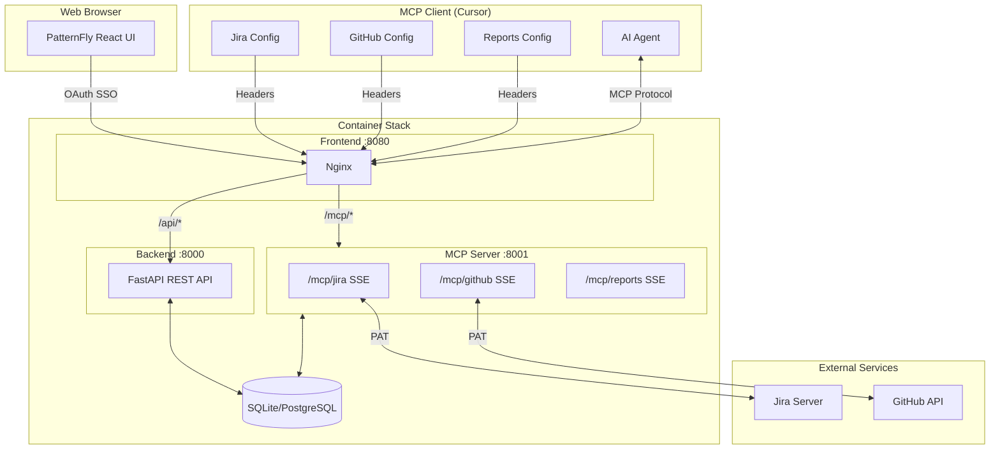
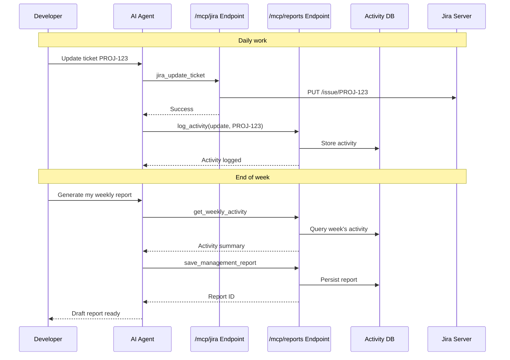

# Jira MCP Server

[](https://www.python.org/downloads/)
[](https://opensource.org/licenses/MIT)
[](https://modelcontextprotocol.io/)

A Model Context Protocol (MCP) server that connects Jira and GitHub to AI-powered IDEs. Developers spend less time writing status updates—the IDE pulls real data and drafts reports from actual activity.

## Quick Start

```bash
# 1. Clone and start with Docker Compose
git clone <repository-url> && cd jira-mcp
docker-compose up -d

# 2. Configure Cursor IDE (.cursor/mcp.json)
```

```json
{
  "mcpServers": {
    "jira": {
      "url": "http://localhost:8080/mcp/jira",
      "headers": {
        "X-Jira-Server-URL": "https://jira.example.com",
        "X-Jira-Token": "your-jira-pat"
      }
    },
    "github": {
      "url": "http://localhost:8080/mcp/github",
      "headers": {
        "X-GitHub-Token": "your-github-pat"
      }
    },
    "reports": {
      "url": "http://localhost:8080/mcp/reports",
      "headers": {
        "X-Username": "your-username"
      }
    }
  }
}
```

## Overview

Developers interact with Jira and GitHub daily. This server exposes those systems as structured MCP tools via separate endpoints, tracks activity locally, and generates weekly or management reports on demand. Credentials flow from the client via HTTP headers; the server stores only activity logs and reports.

The project includes a web UI for viewing activity, managing reports, and team administration.

## Architecture

The system uses a multi-container architecture with three main components:



| Container | Port | Description |
|-----------|------|-------------|
| Frontend | 8080 | Nginx serving static UI, proxying `/api/*` to backend and `/mcp/*` to MCP server |
| Backend | 8000 | FastAPI REST API for web UI (users, teams, activities, reports) |
| MCP Server | 8001 | SSE server providing MCP tools for AI integration |

## Report Generation Flow



## Features

### MCP Tools (for AI Agents)

#### Jira Operations (`/mcp/jira` endpoint)
- **Tickets** — List, view, create, update
- **Comments** — Add, update, delete
- **Hierarchy** — Link issues, create subtasks, set epics
- **Metadata** — Projects, components, issue types, statuses, transitions, priorities

#### GitHub Operations (`/mcp/github` endpoint)
- **Pull Requests** — List, view details, files, commits, diff
- **Issues** — List, view, create, update, close, reopen
- **Comments** — Add comments to PRs and issues
- **Search** — Query PRs and issues across repositories

#### Reports Operations (`/mcp/reports` endpoint)
- **Activity Tracking** — Log actions on Jira tickets (`PROJ-123`) and GitHub issues (`owner/repo#123`)
- **Weekly Reports** — Generate and save Markdown reports from logged activity
- **Management Reports** — Store and manage AI-written summaries for stakeholders

### Web UI (PatternFly React)

The web UI provides a dashboard for activity tracking and report management:

- **Dashboard** — Overview of recent activity
- **Activities** — View and search logged activities with clickable ticket links
- **My Reports** — Personal weekly and management reports
- **Management Reports** — View all management reports (accessible to all users)
- **Team Dashboard** — Team activity overview (manager/admin only)
- **Team Reports** — Team report management (manager/admin only)
- **Admin** — User and team administration (admin only)
- **Settings** — User preferences
- **Dark Mode** — Toggle between light and dark themes

**Authentication:** The UI integrates with OpenShift OAuth for single sign-on. In development mode, authentication can be bypassed.

## Requirements

- Docker and Docker Compose (recommended)
- Or: Python 3.11+ for local development
- Jira Server or Data Center with PAT authentication
- (Optional) GitHub PAT for PR and issue tools

## Installation

### Docker Compose (Recommended)

```bash
git clone <repository-url>
cd jira-mcp
docker-compose up -d
```

Access the web UI at `http://localhost:8080`

### Local Development

```bash
git clone <repository-url>
cd jira-mcp
python -m venv venv
source venv/bin/activate
pip install -e .

# Run MCP server only
python -m jira_mcp.server --host 0.0.0.0 --port 8001

# Or run the REST API backend
uvicorn jira_mcp.api.main:app --host 0.0.0.0 --port 8000
```

## Creating Personal Access Tokens

### Jira PAT

1. Log in to your Jira instance
2. Click your profile icon → **Profile**
3. Go to **Personal Access Tokens** (left sidebar)
4. Click **Create token**
5. Enter a name (e.g., "MCP Server") and set expiration
6. Click **Create** and copy the token immediately (it won't be shown again)

**Required permissions:** The token inherits your Jira user permissions. Ensure you have access to the projects you want to query.

### GitHub PAT

1. Go to [GitHub Settings → Developer settings → Personal access tokens → Tokens (classic)](https://github.com/settings/tokens)
2. Click **Generate new token (classic)**
3. Enter a note (e.g., "MCP Server")
4. Select scopes:
   - `repo` — Full control of private repositories (or `public_repo` for public only)
   - `read:org` — Read org membership (if querying org repos)
5. Click **Generate token** and copy it immediately

**For GitHub Enterprise:** Use the same process on your enterprise instance, then set the `X-GitHub-API-URL` header to your API endpoint (e.g., `https://github.yourcompany.com/api/v3`).

## Configuration

### MCP Client Headers

Credentials are passed from the MCP client via headers. Each endpoint requires its own headers.

**Jira (`/mcp/jira`):**

| Header | Required | Description |
|--------|----------|-------------|
| `X-Jira-Server-URL` | Yes | Jira base URL |
| `X-Jira-Token` | Yes | Jira Personal Access Token |
| `X-Jira-Verify-SSL` | No | `true` (default) or `false` |

**GitHub (`/mcp/github`):**

| Header | Required | Description |
|--------|----------|-------------|
| `X-GitHub-Token` | Yes | GitHub PAT |
| `X-GitHub-API-URL` | No | GitHub Enterprise API URL |

**Reports (`/mcp/reports`):**

| Header | Required | Description |
|--------|----------|-------------|
| `X-Username` | Yes | Username for activity tracking |

### Environment Variables

| Variable | Default | Description |
|----------|---------|-------------|
| `DATABASE_URL` | — | PostgreSQL connection string (leave empty for SQLite) |
| `JIRA_MCP_DATA_DIR` | `./data` | SQLite storage directory |
| `DEV_MODE` | `false` | Enable development mode (bypass OAuth, enable API docs) |
| `DEV_EMAIL` | `dev@example.com` | Email to use in development mode |
| `CORS_ORIGINS` | `*` | Allowed CORS origins (comma-separated) |
| `MANAGEMENT_REPORT_INSTRUCTIONS_FILE` | — | Path to custom management report instructions |

## Client Setup

### Cursor IDE

Configure three MCP servers in `.cursor/mcp.json`:

```json
{
  "mcpServers": {
    "jira": {
      "url": "http://localhost:8080/mcp/jira",
      "headers": {
        "X-Jira-Server-URL": "https://jira.example.com",
        "X-Jira-Token": "your-jira-pat"
      }
    },
    "github": {
      "url": "http://localhost:8080/mcp/github",
      "headers": {
        "X-GitHub-Token": "your-github-pat"
      }
    },
    "reports": {
      "url": "http://localhost:8080/mcp/reports",
      "headers": {
        "X-Username": "your-username"
      }
    }
  }
}
```

For GitHub Enterprise:

```json
{
  "mcpServers": {
    "github": {
      "url": "http://localhost:8080/mcp/github",
      "headers": {
        "X-GitHub-Token": "your-github-pat",
        "X-GitHub-API-URL": "https://github.yourcompany.com/api/v3"
      }
    }
  }
}
```

## Running the Server

### Docker Compose

```bash
# SQLite mode (default) - 3 containers: frontend, backend, mcp
docker-compose up -d

# PostgreSQL mode - adds postgres container
docker-compose --profile postgres up -d
```

### Building Container Images

```bash
# Build backend image
docker build -t jira-mcp:backend -f Containerfile.backend .

# Build frontend image
docker build -t jira-mcp:frontend -f Containerfile.frontend .
```

### Local Development

```bash
# MCP server only (for AI tool integration)
python -m jira_mcp.server --host 0.0.0.0 --port 8001

# REST API backend (for web UI)
DEV_MODE=true uvicorn jira_mcp.api.main:app --host 0.0.0.0 --port 8000 --reload

# Frontend development (requires Node.js 22+)
cd ui
npm install
npm run dev
```

### OpenShift Deployment

Kubernetes manifests are provided in the `openshift/` directory:

```bash
# Apply all manifests
kubectl apply -k openshift/

# Or using oc
oc apply -k openshift/
```

The OpenShift deployment includes:
- OAuth proxy sidecar for SSO authentication
- Persistent volume for database storage
- ConfigMap and Secrets for configuration
- Service and Route for external access

## Endpoints

### REST API (Web UI)

| Endpoint | Description |
|----------|-------------|
| `/api/health` | Health check |
| `/api/users/*` | User management |
| `/api/teams/*` | Team management |
| `/api/activities/*` | Activity tracking |
| `/api/reports/*` | Report management |

### MCP Server (AI Tools)

| Endpoint | Description |
|----------|-------------|
| `/mcp/jira` | Jira MCP tools (SSE) |
| `/mcp/jira/messages/` | Jira message handler |
| `/mcp/github` | GitHub MCP tools (SSE) |
| `/mcp/github/messages/` | GitHub message handler |
| `/mcp/reports` | Reports MCP tools (SSE) |
| `/mcp/reports/messages/` | Reports message handler |
| `/health` | MCP server health check |

## Tool Reference

### Jira Tools (`/mcp/jira`)

| Tool | Description |
|------|-------------|
| `jira_list_tickets` | Search tickets by assignee, project, component, epic, status |
| `jira_get_ticket` | Get full ticket details |
| `jira_create_ticket` | Create a new ticket |
| `jira_update_ticket` | Update fields or transition status |
| `jira_add_comment` | Add a comment |
| `jira_get_comments` | List comments |
| `jira_update_comment` | Edit a comment |
| `jira_delete_comment` | Delete a comment |
| `jira_link_issues` | Link two issues |
| `jira_create_subtask` | Create a subtask |
| `jira_set_epic` | Assign an issue to an epic |
| `jira_list_projects` | List accessible projects |
| `jira_list_components` | List components for a project |
| `jira_list_issue_types` | List issue types for a project |
| `jira_list_priorities` | List priority levels |
| `jira_list_statuses` | List statuses for a project |
| `jira_get_transitions` | Get available transitions for a ticket |
| `jira_get_current_user` | Get authenticated user info |

### GitHub Tools (`/mcp/github`)

#### Pull Requests

| Tool | Description |
|------|-------------|
| `github_list_prs` | List PRs for a repository |
| `github_get_pr` | Get PR details |
| `github_get_pr_diff` | Get unified diff |
| `github_get_pr_files` | List changed files with patches |
| `github_get_pr_commits` | List commits in PR |
| `github_get_pr_reviews` | Get reviews |
| `github_get_pr_comments` | Get issue and review comments |
| `github_add_pr_comment` | Add a comment to a PR |
| `github_search_prs` | Search PRs across repositories |

#### Issues

| Tool | Description |
|------|-------------|
| `github_list_issues` | List issues for a repository |
| `github_get_issue` | Get full issue details |
| `github_create_issue` | Create a new issue |
| `github_update_issue` | Update an existing issue |
| `github_close_issue` | Close an issue with optional reason |
| `github_reopen_issue` | Reopen a closed issue |
| `github_get_issue_comments` | Get comments on an issue |
| `github_add_issue_comment` | Add a comment to an issue |
| `github_search_issues` | Search issues across repositories |

#### User

| Tool | Description |
|------|-------------|
| `github_get_current_user` | Get authenticated GitHub user |

### Reports Tools (`/mcp/reports`)

| Tool | Description |
|------|-------------|
| `log_activity` | Record work on a Jira ticket (`PROJ-123`) or GitHub issue (`owner/repo#123`) |
| `get_weekly_activity` | Summarize activity for a week |
| `generate_weekly_report` | Generate Markdown report |
| `save_weekly_report` | Persist report to database |
| `list_saved_reports` | List saved reports |
| `get_saved_report` | Retrieve a report by ID |
| `delete_saved_report` | Delete a report |
| `get_report_instructions` | Get management report generation instructions |
| `save_management_report` | Store AI-generated stakeholder report |
| `list_management_reports` | List reports, optionally by project |
| `get_management_report` | Retrieve full report content |
| `update_management_report` | Edit an existing report |
| `delete_management_report` | Delete a report |

## Example Prompts

- *"List my in-progress Jira tickets and summarize blockers."* (uses `/mcp/jira`)
- *"Show open PRs for org/repo and summarize review feedback."* (uses `/mcp/github`)
- *"Create a GitHub issue to track this bug."* (uses `/mcp/github`)
- *"Log that I worked on PROJ-123 today."* (uses `/mcp/reports`)
- *"Log activity on github.com/org/repo#456."* (uses `/mcp/reports`)
- *"Generate my weekly report and save it."* (uses `/mcp/reports`)
- *"Write a management report for PROJ using this week's activity."* (uses `/mcp/reports`)

## Project Structure

```
jira-mcp/
├── src/jira_mcp/
│   ├── server.py              # MCP SSE server with /mcp/jira, /mcp/github, /mcp/reports
│   ├── jira_client.py         # Jira API wrapper
│   ├── github_client.py       # GitHub API wrapper (PRs and Issues)
│   ├── config.py              # Configuration helpers
│   ├── api/                   # REST API for web UI
│   │   ├── main.py            # FastAPI application
│   │   ├── deps.py            # Dependencies
│   │   ├── middleware/
│   │   │   └── oauth.py       # OAuth proxy middleware
│   │   └── routes/
│   │       ├── health.py      # Health check
│   │       ├── users.py       # User management
│   │       ├── teams.py       # Team management
│   │       ├── activities.py  # Activity tracking
│   │       └── reports.py     # Report management
│   ├── db/
│   │   ├── database.py        # Database connection
│   │   └── models.py          # SQLAlchemy models
│   └── tools/
│       ├── tickets.py         # Jira ticket tools
│       ├── comments.py        # Jira comment tools
│       ├── discovery.py       # Jira metadata tools
│       ├── reports.py         # Activity and report tools
│       └── schemas.py         # Pydantic schemas
├── ui/                        # PatternFly React frontend
│   ├── src/
│   │   ├── App.tsx            # Main application with routing
│   │   ├── api/               # API client
│   │   ├── auth/              # Authentication context
│   │   ├── components/        # Reusable components
│   │   ├── pages/             # Page components
│   │   └── types/             # TypeScript types
│   ├── package.json
│   └── vite.config.ts
├── openshift/                 # Kubernetes/OpenShift manifests
│   ├── deployment.yaml        # Pod with oauth-proxy, frontend, backend, mcp containers
│   ├── service.yaml           # Service definition
│   ├── route.yaml             # OpenShift route
│   ├── configmap.yaml         # Configuration
│   ├── secrets.yaml           # Secrets template
│   ├── pvc.yaml               # Persistent volume claim
│   └── kustomization.yaml     # Kustomize configuration
├── tests/
├── Containerfile.backend      # Backend container (Python/FastAPI)
├── Containerfile.frontend     # Frontend container (Nginx/React)
├── nginx.conf.template        # Nginx configuration template
├── docker-compose.yaml        # Multi-container orchestration
├── env.example                # Environment variables template
├── pyproject.toml
├── requirements.txt
└── README.md
```

## Troubleshooting

| Issue | Resolution |
|-------|------------|
| SSL errors | Set `X-Jira-Verify-SSL: false` in client headers |
| Auth failures | Verify PAT is valid and has required permissions |
| Connection refused | Confirm server is running and endpoint is reachable |
| Database errors | Check `JIRA_MCP_DATA_DIR` is writable or `DATABASE_URL` is correct |
| Missing headers | Ensure client sends required headers for the endpoint (`X-Username` for `/mcp/reports`) |
| Tools not loading | Restart Cursor after updating `.cursor/mcp.json` |
| Reports not saving | Verify `X-Username` header is set on the `/mcp/reports` endpoint |
| OAuth errors | Check OpenShift service account has correct redirect URI annotation |
| Frontend not loading | Verify nginx config and `BACKEND_URL`/`MCP_URL` environment variables |

## Development

```bash
# Install development dependencies
pip install -e ".[dev]"

# Run tests
pytest

# Format code
black src/ tests/
ruff check src/ tests/

# Type checking
mypy src/

# Frontend development
cd ui
npm install
npm run dev
npm run lint
npm run build
```

## License

MIT
