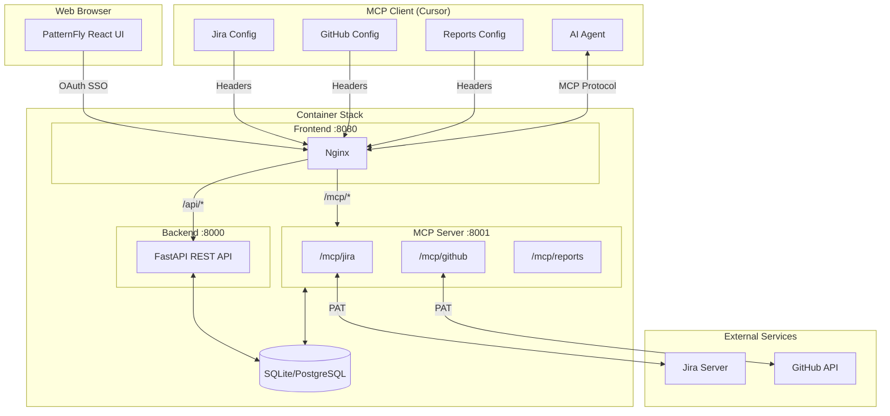
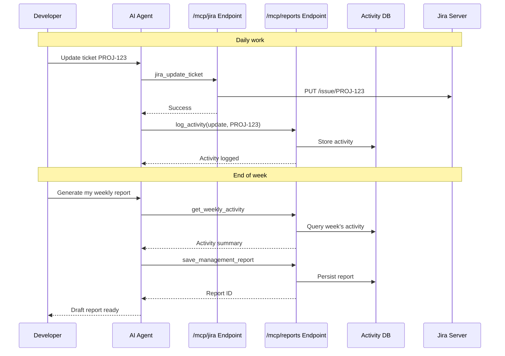

# Architecture

This document describes the system architecture, container setup, and data flows.

## System Overview

Ghost uses a multi-container architecture with three main components that work together to provide MCP tools for AI agents and a web UI for activity management.

## Container Details

| Container | Port | Description |
|-----------|------|-------------|
| Frontend | 8080 | Nginx serving static UI, proxying `/api/*` to backend and `/mcp/*` to MCP server |
| Backend | 8000 | FastAPI REST API for web UI (users, teams, activities, reports) |
| MCP Server | 8001 | Streamable HTTP server providing MCP tools for AI integration |

## Data Flow

### Credential Handling

Credentials flow from the MCP client via HTTP headers. The server never stores credentials—only activity logs and reports are persisted.

1. User configures PATs in their IDE's MCP configuration
2. IDE sends credentials as HTTP headers with each request
3. Server uses credentials to authenticate with Jira/GitHub
4. Activity data is stored locally without credentials

### Report Generation Flow

## API Endpoints

### REST API (Web UI)

| Endpoint | Description |
|----------|-------------|
| `/api/health` | Health check |
| `/api/users/*` | User management |
| `/api/teams/*` | Team management |
| `/api/activities/*` | Activity tracking |
| `/api/reports/*` | Report management |

### MCP Server (AI Tools — Streamable HTTP)

| Endpoint | Description |
|----------|-------------|
| `/mcp/jira` | Jira MCP tools (Streamable HTTP) |
| `/mcp/github` | GitHub MCP tools (Streamable HTTP) |
| `/mcp/reports` | Reports MCP tools (Streamable HTTP) |
| `/health` | MCP server health check |

## Technology Stack

### Backend
- **Python 3.11+** - Runtime
- **FastAPI** - REST API framework
- **SQLAlchemy** - ORM
- **SQLite/PostgreSQL** - Database
- **MCP SDK** - Model Context Protocol implementation

### Frontend
- **React 18** - UI framework
- **PatternFly 5** - Red Hat design system
- **Vite** - Build tool
- **TypeScript** - Type safety

### Infrastructure
- **Podman** - Containerization
- **Nginx** - Reverse proxy
- **OpenShift** - Kubernetes deployment

## See Also

- [Deployment](deployment.md) - How to deploy the containers
- [Configuration](configuration.md) - Environment variables and settings
- [Tools Reference](tools-reference.md) - Available MCP tools
